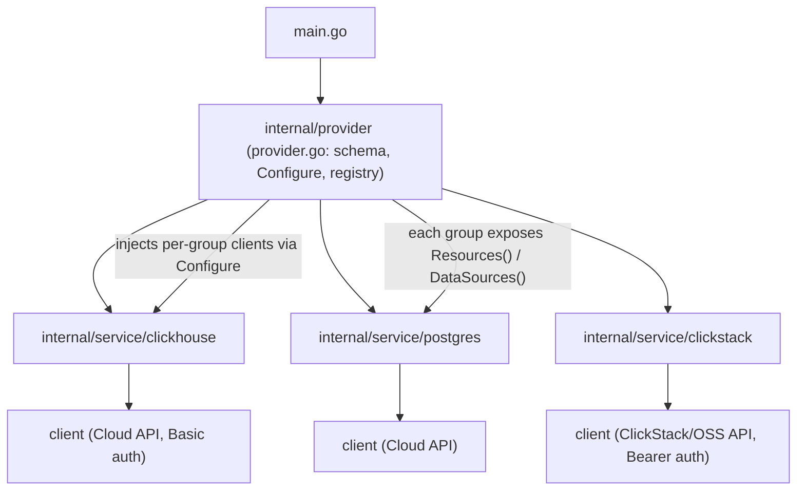

# RFC 0001: Consolidate ClickStack into the ClickHouse Terraform provider

- **Status:** Proposed
- **Author:** ClickStack team
- **Reviewers:** ClickHouse Terraform / API group; Postgres team; ClickStack team
- **Created:** 2026-06-15
- **Target:** Soft release ~1 month out (mid-July 2026)

## Summary

We propose consolidating the ClickStack Terraform provider
(`terraform-provider-clickstack`) into the existing ClickHouse Terraform
provider (`terraform-provider-clickhouse`), so ClickHouse ships a single
provider rather than several.

To make a single provider sustainable across multiple teams (ClickHouse,
Postgres, ClickStack), we additionally propose restructuring the repository
into an AWS-style service-group layout (`internal/service/<group>/`) with
per-team ownership, and adopting the engineering conventions and process the
ClickStack provider already follows (clean client/provider separation,
documented Go conventions, ADRs, conventional commits, and coverage gates).

This is a decision/proposal document intended to get team buy-in. Each
recommendation is marked so the group can accept or amend it section by
section.

## Background and motivation

ClickHouse currently maintains (or is about to maintain) multiple Terraform
providers built by different teams. The ClickStack team has been developing
`terraform-provider-clickstack` independently, and the broader conclusion from
the recent meeting with the ClickHouse Terraform / API group is that
everything should live under one provider: `terraform-provider-clickhouse`.

The reasons mirror how HashiCorp structures the
[AWS provider](https://github.com/hashicorp/terraform-provider-aws/tree/main/internal/service):
a single provider binary, but with code organized into many independent
**service** packages (e.g. CloudSearch vs CloudTrail vs CloudWatch), each
effectively owned by a different team. A single provider gives users one thing
to install and one place to look, while the service-package boundary keeps
teams from stepping on each other.

Applied to ClickHouse, that means logical groups such as:

- **ClickHouse** group (the existing Cloud resources: services, ClickPipes,
  RBAC, private endpoints, org settings).
- **Postgres** group (the Postgres team's resources, already present in the
  provider today).
- **ClickStack** group (what we are bringing over).

Notes captured from the meeting that motivate this RFC:

- The current provider's auth model (API key) lines up with what we intend for
  both OSS and Cloud, so auth is not a blocker.
- As more teams onboard, they want to group resources like the AWS provider
  does, with a ClickHouse group and a ClickStack group.
- If Cloud and OSS behavior diverge substantially, they may eventually want a
  ClickStack Cloud group and a ClickStack OSS group, but we likely won't need
  that.
- A soft release for us was floated at ~1 month out.
- Landing under a group may require reformatting the repo a bit, but the group
  has confidence that is manageable.
- There is interest in eventually *defining the groups* in the Terraform
  provider repo itself. That probably should not fall on us, but if it is
  minor we can take it on.
- Overall conclusion: it makes sense to land in their provider.

## Goals

- Ship a **single** ClickHouse Terraform provider that includes ClickStack
  resources.
- Establish a **multi-team service-group layout** so ClickHouse, Postgres, and
  ClickStack can each evolve their resources with minimal coordination.
- Move the consolidated repo toward **idiomatic, consistent Go** and the
  process maturity ClickStack already practices.
- Confirm a **single API-key auth model** that serves both OSS and Cloud.

## Non-goals

- Building general-purpose "group definition" tooling for the upstream
  Terraform provider ecosystem. We flag this as out of scope unless it turns
  out to be trivial (see Open questions).
- Splitting ClickStack into separate Cloud vs OSS groups now. We will design so
  it is possible later, but we do not expect to need it for the initial
  release.
- A big-bang rewrite of existing ClickHouse Cloud resources. The restructure
  should be mechanical and incremental, preserving current behavior and
  resource/state compatibility.
- Changing user-facing resource names or the registry address as part of this
  RFC.

## Current state

Both providers already share a strong foundation, which makes consolidation
low-risk technically:

- Both use `terraform-plugin-framework` (v1.19.0), the same module
  organization (`github.com/ClickHouse/...`), and Go 1.26.
- Both inject a single API client into resources/data sources via the
  provider's `Configure`.
- Both authenticate with an API key (the difference is transport: Basic vs
  Bearer; see below).

**`terraform-provider-clickhouse` (consolidation target) — mature but flat**

- 14 resources and 8 data sources today, including the Postgres team's
  resources.
- Code lives under `pkg/`: `pkg/resource/`, `pkg/datasource/`, `pkg/provider/`,
  `pkg/project/`, and a monolithic `pkg/internal/api` (one package, split by
  filename per domain). Placing these under `pkg/` advertises them as a public,
  importable surface (see "Package layout" below) — only `pkg/internal/api` is
  actually compiler-private.
- Everything is flat: no service grouping; logical domains exist only by file
  naming convention.
- Resource registration goes through `GetResourceFactories()` in
  `pkg/resource/register_stable.go` (build-tagged `!alpha`), with data sources
  listed in `DataSources()` in `pkg/provider/provider.go`.
- Auth is HTTP Basic using a token key/secret pair against the ClickHouse Cloud
  API.
- No documented Go conventions, ADRs, or coverage gates.
- "Alpha" status today is a runtime warning, not a compile-time gate.

**`terraform-provider-clickstack` — small but process-mature**

- Small surface area (one real resource, `clickstack_connection`, plus a
  scaffold example).
- Clean two-layer split: `internal/provider/` (Terraform-facing) and
  `internal/client/` (HTTP/JSON, no Terraform imports).
- Documented engineering practices: `GO_CONVENTIONS.md`, ADRs under
  `decisions/`, conventional commits, coverage tooling (`.testcoverage.yml`),
  and a Makefile that mirrors CI exactly.
- Auth is Bearer API key with env-var fallbacks and a retryable HTTP client.

**Neither** repo currently uses the AWS-style `internal/service/<service>/`
layout the group wants. That layout is net-new for both.

## Proposal

### 1. Consolidate ClickStack into `terraform-provider-clickhouse`

Land the ClickStack resources, client, and tests inside the ClickHouse
provider so there is one provider binary, one registry entry, and one place to
contribute.

**Recommendation:** Accept. This is the explicit conclusion from the meeting.

### 2. Adopt an AWS-style service-group layout

Introduce `internal/service/<group>/` packages, one per owning team/domain,
each containing its own resources, data sources, and (where useful) its own
client surface. A central registration step aggregates each group's resource
and data-source factories into the provider.

This is a natural evolution of the existing `GetResourceFactories()` pattern:
instead of one flat list, the provider composes lists contributed by each
service group, so a team can add or change resources by touching only its own
package. The concrete mechanism is proposed in "Group definition: the
service-package registry" below.

**Recommendation:** Accept, and migrate the existing ClickHouse Cloud and
Postgres code into groups as part of the same effort so we don't end up with a
half-converted tree.

### 3. Per-team ownership via CODEOWNERS

Map each service group to its owning team in `CODEOWNERS` so reviews route
automatically and teams own their slice. This is the mechanism that makes "the
Postgres team owns Postgres, the ClickStack team owns ClickStack" real.

**Recommendation:** Accept.

### 4. Adopt ClickStack's conventions and process repo-wide

Bring the consolidated repo up to the standard ClickStack already follows:

- **Move `pkg/` to `internal/`** (see "Package layout" below) — the single most
  visible divergence from ClickStack's conventions.
- The `internal/client` vs `internal/provider` separation (client layer must
  not import the Terraform framework).
- A `GO_CONVENTIONS.md` documenting the human-judgment rules.
- ADRs under `decisions/` for architectural choices (this RFC can become or
  seed the first one in the consolidated repo).
- Conventional commits and the matching commit-msg hook. We adopt these because
  they keep git history machine-readable: the `type` (`feat`/`fix`/...) drives
  automated changelog generation and signals semantic-version intent (with `!`
  marking breaking changes), which matters for a provider whose users pin
  versions; the optional `scope` carries the service-group identity into history
  (e.g. `feat(clickstack): ...`), aiding review and triage across teams; and a
  `commit-msg` hook enforces it as a tool rather than a guideline.
- Coverage tooling/gates, starting permissive and tightened over time.

#### Package layout: `pkg/` vs `internal/`

This is worth calling out explicitly because the two repos disagree today, and
adopting ClickStack's `GO_CONVENTIONS.md` directly contradicts the ClickHouse
provider's current layout.

The ClickHouse provider puts most of its code under `pkg/`
(`pkg/resource/`, `pkg/datasource/`, `pkg/provider/`, `pkg/project/`). By Go
convention, `pkg/` signals "this is a public, importable API" — but the
compiler does nothing to enforce or version that surface. For a Terraform
provider, every one of those packages is an implementation detail; none is a
supported public API, so `pkg/` advertises a contract we have no intention of
honoring. (Note the existing layout already half-admits this with
`pkg/internal/api`, which *is* compiler-private precisely because it sits under
an `internal/` directory.)

ClickStack's convention is the opposite, and is the rule we would inherit:

> **Rule:** new code goes under `internal/`. Reach for `pkg/` only if we ever
> deliberately decide to publish a reusable, semver-stable library — and
> document that decision when we do.

The motivation is that `internal/` is a **hard, compiler-level guarantee**:
anything under an `internal/` directory can only be imported by code rooted at
that directory's parent, so an outside module that tries to import it fails to
build. That is exactly what we want for a provider where every package is
private by intent.

Concretely, consolidation should relocate the surviving packages from `pkg/`
into `internal/` (`pkg/resource` + `pkg/datasource` → the per-group
`internal/service/<group>/` packages; `pkg/provider` → `internal/provider`;
`pkg/internal/api` → per-group `client` packages). This is mostly mechanical
(import-path rewrites) and pairs naturally with the Phase 1 restructure, since
the files are moving anyway.

**Recommendation:** Accept in principle; sequence it after — or as part of —
the structural move so we are not reformatting and restructuring
simultaneously. Fold the `pkg/` → `internal/` relocation into Phase 1, where
those files already move into service groups.

### 5. Confirm a single API-key auth model for OSS and Cloud

The meeting confirmed the API-key model fits both OSS and Cloud. The one
concrete reconciliation item is transport: the ClickHouse provider uses HTTP
Basic (key/secret), while ClickStack uses a Bearer token. Because the client
layer is per-group, each group can keep its own auth transport against its own
endpoint while sharing the provider's configuration surface.

**Recommendation:** Accept; treat Basic-vs-Bearer as a per-group client detail,
not a blocker (see Open questions for the configuration-surface decision).

## Target structure (sketch)

This is illustrative, not a final spec.



Indicative tree:

```
terraform-provider-clickhouse/
  main.go
  internal/
    provider/                # schema, Configure, aggregates group factories
    service/
      clickhouse/            # existing Cloud resources (service, clickpipe, rbac, ...)
        client/
      postgres/              # Postgres team resources
        client/
      clickstack/            # ported from terraform-provider-clickstack
        client/
  docs/
    rfcs/
  decisions/                 # ADRs
  GO_CONVENTIONS.md
  CODEOWNERS
```

We will decide during implementation whether each group gets its own nested
`client` package or whether a shared `internal/client` core is factored out
with per-group endpoints; the diagram shows per-group clients as the simplest
starting point that respects today's separate APIs.

## Group definition: the service-package registry

This is the concrete proposal for *defining the groups* in-repo (the item the
Terraform group raised). It turns a service group from a naming convention into
a first-class, self-describing unit. It is the ClickHouse-sized version of the
AWS provider's service-package model: we keep the self-describing registration
interface and per-group metadata, but deliberately start **without** code
generation.

### The interface

Each group implements one `ServicePackage` interface (proposed home:
`internal/service`):

```go
package service

import (
	"github.com/hashicorp/terraform-plugin-framework/datasource"
	"github.com/hashicorp/terraform-plugin-framework/resource"
)

// ServicePackage is implemented once per service group (clickhouse, postgres,
// clickstack). A group self-describes its metadata and the resources and data
// sources it contributes to the provider.
type ServicePackage interface {
	Meta() Metadata
	Resources() []func() resource.Resource
	DataSources() []func() datasource.DataSource
}

type Stability string

const (
	StabilityStable Stability = "stable"
	StabilityAlpha  Stability = "alpha"
)

// Metadata is the machine-readable definition of a group.
type Metadata struct {
	Name      string    // stable identifier, e.g. "clickstack"
	HumanName string    // docs/diagnostics label, e.g. "ClickStack"
	Owner     string    // CODEOWNERS team, e.g. "@ClickHouse/clickstack"
	Stability Stability // default maturity for the group
}
```

### A group implements it

Each `internal/service/<group>/` package exposes one constructor. Adding a
resource means editing only this file, inside your own package:

```go
package clickstack

import (
	"github.com/hashicorp/terraform-plugin-framework/datasource"
	"github.com/hashicorp/terraform-plugin-framework/resource"

	"github.com/ClickHouse/terraform-provider-clickhouse/internal/service"
)

func ServicePackage() service.ServicePackage { return servicePackage{} }

type servicePackage struct{}

func (servicePackage) Meta() service.Metadata {
	return service.Metadata{
		Name:      "clickstack",
		HumanName: "ClickStack",
		Owner:     "@ClickHouse/clickstack",
		Stability: service.StabilityAlpha,
	}
}

func (servicePackage) Resources() []func() resource.Resource {
	return []func() resource.Resource{
		NewConnectionResource,
	}
}

func (servicePackage) DataSources() []func() datasource.DataSource {
	return nil
}
```

### One central list, edited only when a group is added

```go
// internal/service/registry.go
func ServicePackages() []ServicePackage {
	return []ServicePackage{
		clickhouse.ServicePackage(),
		postgres.ServicePackage(),
		clickstack.ServicePackage(),
	}
}
```

This is the only shared file, and it changes only when a brand-new group is
introduced (rare) — never when a team adds a resource to an existing group.
That property is what removes day-to-day cross-team merge contention.

### The provider composes the registry

`NewBuilder` already injects resource factories today
(`provider.NewBuilder(resource.GetResourceFactories())` in `main.go`). We change
the injected type from a flat `[]func() resource.Resource` to
`[]ServicePackage`, and the provider flattens it:

```go
func (p *clickhouseProvider) Resources(_ context.Context) []func() resource.Resource {
	var out []func() resource.Resource
	for _, sp := range p.servicePackages {
		out = append(out, sp.Resources()...)
	}
	return out
}
```

`DataSources()` takes the same shape, replacing the hand-maintained list
currently in `pkg/provider/provider.go`.

### What the metadata buys us (without code generation)

- **Validation in CI.** A single unit test over `ServicePackages()` can assert
  unique group names, globally unique Terraform resource/data-source type
  names, and that every registered type maps to exactly one group. This is the
  "drift is caught in CI" benefit, achieved with a test instead of a generator.
- **Data-driven alpha gating.** `Stability` lets us retire the `alpha` build
  tag / `register_debug.go` split in favor of a runtime filter or warning
  derived from metadata (see the alpha open question).
- **Ownership that matches code.** `Owner` can be cross-checked against
  `CODEOWNERS` so registration and review-routing never drift apart.
- **Docs.** `HumanName` can drive grouped Terraform Registry documentation via
  subcategories — see below.

### Surfacing groups in the Registry (subcategories)

The groups should not only exist in code; they should be visible to users. The
Terraform Registry has a native grouping mechanism for exactly this: an optional
[`subcategory`](https://developer.hashicorp.com/terraform/registry/providers/docs#subcategories)
field in each doc's YAML frontmatter, which groups resources, data sources, and
functions under a named heading in the Registry navigation sidebar ("to group
these resources by a service or other dimension").

Today every generated doc carries `subcategory: ""` (the provider has no
`templates/` directory), so the Registry renders one long, flat list. As we add
ClickStack and more Postgres surface area, that list becomes hard to scan — the
Registry docs explicitly recommend subcategories once the resource count is
large.

**Proposal: one subcategory per service group, sourced from the registry.**
Map each service group to a Registry subcategory using the group's
`Metadata.HumanName` (e.g. "ClickHouse", "Postgres", "ClickStack"), so the
in-code group and the published docs grouping share a single source of truth.

Mechanics, in increasing order of investment:

- `tfplugindocs` reads `subcategory` from each resource's template frontmatter
  (`templates/resources/<name>.md.tmpl`). Hand-maintaining one template per
  resource is the naive option and is exactly the kind of duplication the
  registry should remove.
- Preferred: drive it from the `ServicePackage` metadata. Because the registry
  already maps every resource type to its owning group, a small `go generate`
  step (or a shared template helper) can stamp the correct `subcategory` into
  each generated doc — no per-resource bookkeeping.
- Enforce it in CI with `tfplugindocs validate --allowed-resource-subcategories-file`,
  pinning the permitted subcategories to exactly the registry's group names. A
  typo or an unregistered group then fails the build — the same drift-prevention
  theme as the registry validation test.

**One decision to flag:** the Registry allows only a *single* subcategory per
doc, and reserves two special buckets that always render at the bottom — `Beta`
and `Deprecated`. So a resource cannot be both "in the ClickStack group" and
"Beta" in the sidebar; group and stability compete for the one slot. Recommended
default: always use the **group** as the subcategory, and continue to express
alpha/beta status via the existing runtime warning and an in-page docs callout
(`~>` note), rather than spending the subcategory slot on stability. We can
revisit if a dedicated `Beta` bucket proves more valuable to users than group
grouping.

### Deliberately deferred: code generation

The AWS provider generates per-group registration from `// @Resource`
annotations plus a service CSV. We propose **not** doing that initially: with a
handful of groups, the hand-written `ServicePackage()` constructor is trivial
and readable, and a generator is a meaningful platform investment. Crucially,
adding annotations/codegen later would emit `service_package_gen.go` files
*behind the same interface* above — so this design is forward-compatible, not a
dead end.

**Recommendation:** Accept the interface + central registry + validation test
now (it folds into Phase 1). Defer annotation-driven codegen until the number
of groups/resources makes hand-written constructors error-prone.

## Migration phases

1. **Restructure existing code into groups.** Move the current `pkg/`
   resources, data sources, and API client into `internal/service/clickhouse/`
   and `internal/service/postgres/`, introduce the `ServicePackage` interface +
   `ServicePackages()` registry + validation test, and change provider
   registration to compose per-group lists. Behavior, resource names, and state
   stay identical. This is the largest mechanical change and should land first,
   on its own, so it is easy to review and revert.
2. **Port ClickStack.** Bring `connection` (and the client) into
   `internal/service/clickstack/`, wire its client into the provider's
   `Configure`, and migrate its tests.
3. **Layer in conventions and CI.** Add `GO_CONVENTIONS.md`, `CODEOWNERS`,
   ADRs, conventional-commit enforcement, and coverage tooling; align the
   Makefile/CI so local and CI checks match.
4. **Docs and soft release.** Regenerate provider docs, wire group-derived
   Registry subcategories (and `tfplugindocs validate` subcategory enforcement),
   add ClickStack examples, validate end to end, and cut the soft release.

## Timeline

Targeting the ~1-month soft release discussed with the group:

- **Week 1:** Phase 1 restructure (clickhouse + postgres groups) merged behind
  no behavior change; agree group boundaries and CODEOWNERS mapping.
- **Week 2:** Phase 2 ClickStack port; auth-transport reconciliation.
- **Week 3:** Phase 3 conventions/CI; coverage gates introduced permissively.
- **Week 4:** Phase 4 docs, examples, end-to-end validation, soft release.

## Open questions

- **Defining groups: codegen and upstream contribution.** This RFC now proposes
  an in-repo group definition (the service-package registry above), so the
  remaining questions are narrower: (a) do we eventually add AWS-style
  annotation/CSV code generation on top of the interface, and (b) is any of this
  worth contributing upstream to the broader Terraform provider effort?
  Recommend deferring both; neither should gate consolidation.
- **OSS vs Cloud split for ClickStack.** Do we anticipate behavior divergent
  enough to justify separate `clickstack-oss` and `clickstack-cloud` groups?
  Current expectation: no. We will keep the layout amenable to a later split.
- **Provider configuration surface for two auth transports.** Should OSS and
  Cloud credentials be configured as distinct provider attributes/env vars, or
  unified? This drives the `Configure` schema and is the main user-facing
  decision in item 5.
- **Registry / module naming.** Confirm we keep the `ClickHouse/clickhouse`
  registry address and module path; ClickStack users would migrate to
  `clickhouse_*`-style resources (naming TBD) — out of scope for this RFC but
  needs an owner.
- **Alpha gating.** Should newly ported ClickStack resources ship behind the
  existing runtime alpha warning, the `alpha` build tag, or as stable? The
  registry's `Stability` metadata gives us a data-driven option here, which
  could replace the current build-tag split if we want it. Note this interacts
  with Registry subcategories: a doc gets only one subcategory, so using the
  group as the subcategory means stability is shown via a docs callout rather
  than the Registry's special `Beta` bucket (see "Surfacing groups in the
  Registry").

## Risks and alternatives

- **Keep providers separate (status quo).** Lowest immediate effort, but
  multiplies maintenance, fragments the user experience, and diverges
  conventions further over time. Rejected per the meeting consensus.
- **Mono-repo with multiple provider binaries.** Shares CI/conventions but
  still ships multiple providers to users; does not deliver the "one provider"
  goal. Rejected.
- **Consolidate without restructuring (flat merge).** Fastest path to one
  binary, but bakes in the current flat layout and makes multi-team ownership
  painful exactly as more teams onboard. Rejected in favor of doing the
  service-group move now, while the surface area is smaller.
- **Primary risk of the chosen path:** the Phase 1 restructure touches a lot of
  files. We mitigate by keeping it behavior-preserving (no resource/state
  changes), landing it independently, and relying on existing tests plus the
  E2E workflows before the port and convention changes layer on top.

## Decision

Pending team review. On acceptance, this RFC becomes the basis for the first
ADR in the consolidated repo and the four-phase migration above.
